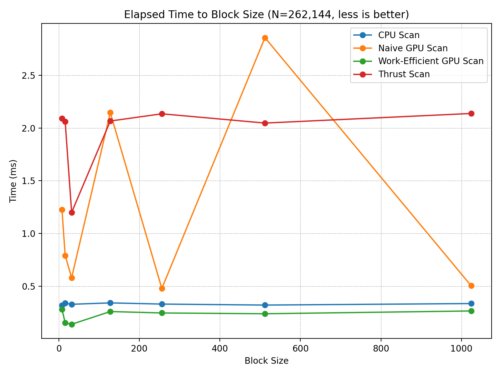
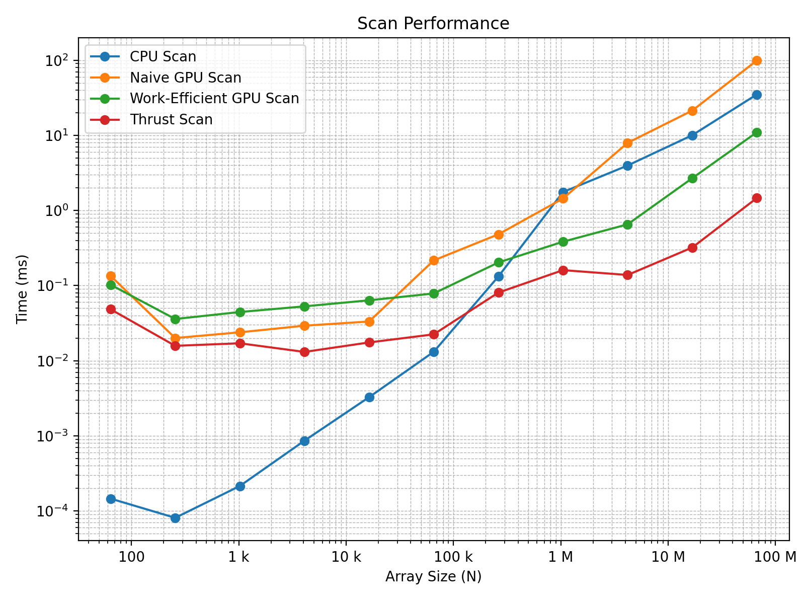
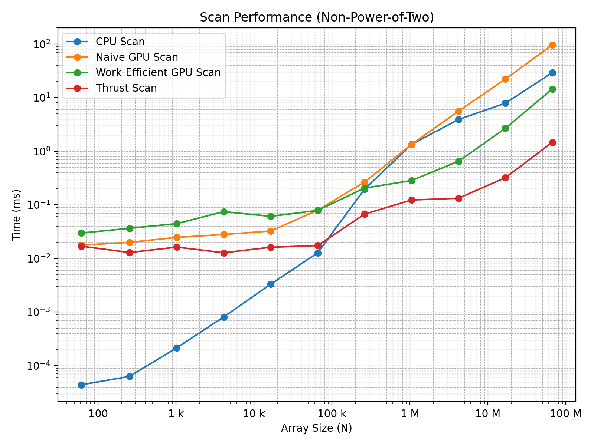
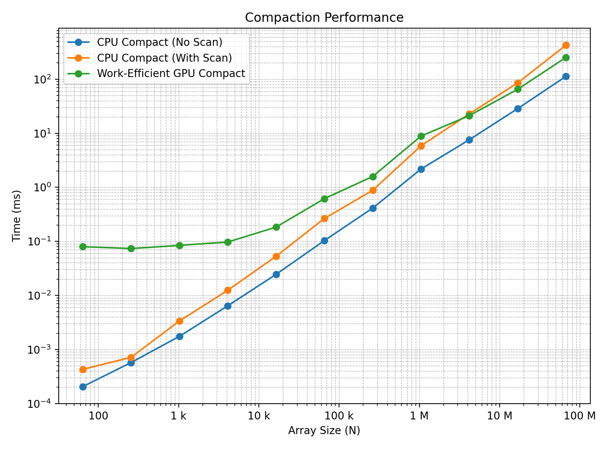
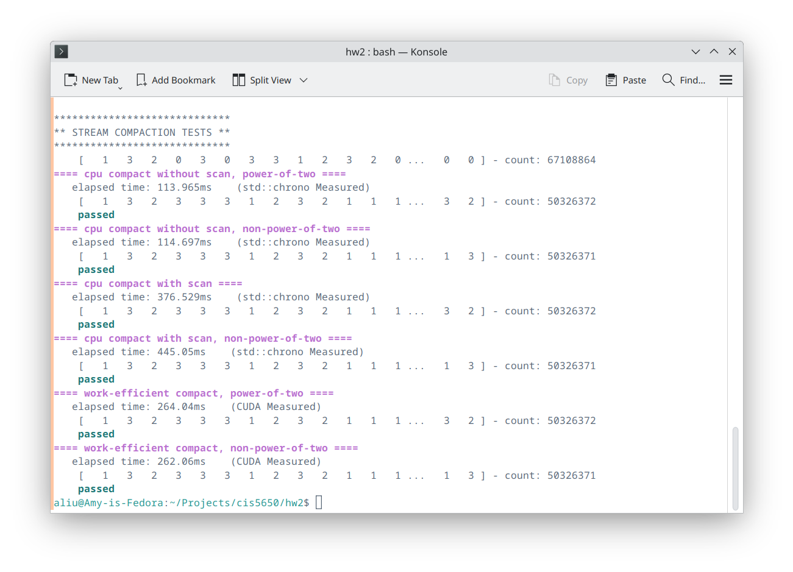

CUDA Parallel Scan Algorithm and Stream Compaction Implementation
======================

University of Pennsylvania, CIS 5650: GPU Programming and Architecture, Project 2

- Amy Liu
  - [Personal Website](https://amyliu.dev), [LinkedIn](https://linkedin.com/in/miyalana), [Github](https://github.com/mialana).
- Tested on: Fedora 42 KDE Plasma, Wayland Protocol, Optimus GPU (Intel(R) Core(TM) Ultra 9 275HX 32GiB, NVIDIA GeForce RTX 5070Ti 12227MiB)

## Project Description

This project implements **stream compaction** in CUDA, which is used to remove `0`s from an array of integers. In a path tracer, this translates to removing terminated paths from the active ray pool, making it an important performance optimization.

Stream compaction relies on the **prefix sum (scan)** operation. In this project, I implemented:

- A **CPU baseline implementation** of scan and compaction.
- A **Naive GPU scan** using repeated passes and global memory.
- A **Work-Efficient GPU scan** using an up-sweep/down-sweep balanced tree method.
- A **GPU stream compaction** method built on top of the work-efficient scan.
- A **Thrust-based scan** (wrapping `thrust::exclusive_scan`).
- **Extra Credit (Part 5)**: analysis of inefficiency in work-efficient scan and optimizations.

## Implementation Breakdown

### CPU Scan & Compaction
- **Scan**: A straightforward exclusive prefix sum using a sequential loop.
- **Compaction (without scan)**: Linearly traverses the array, writing only nonzero elements into the output.
- **Compaction (with scan)**: Converts the array to a boolean mask, performs a scan to compute write indices, and scatters nonzero values. Mirrors the GPU design but slower due to sequential execution.

### Naive GPU Scan
- Performs `ilog2ceil(n)` iterations.
- In each iteration, every thread reads from the input array and writes to a separate output array with an increasing offset.
- Arrays are swapped between passes.
- **Downside**: Requires multiple full passes over global memory. Performance is sensitive to block configuration and can hit *performance cliffs* when register or memory usage reduces parallel occupancy.

### Work-Efficient GPU Scan
- Uses the Blelloch scan:
  1. **Up-sweep (reduce)**: Build a binary tree of partial sums.
  2. **Down-sweep**: Propagate prefix sums back down the tree to form the exclusive scan.
- Can be performed in-place, avoiding extra arrays.
- Padding is used for non-power-of-two sizes.
- Much more efficient because each element is touched `O(log n)` times, rather than `O(n log n)` total work.

### GPU Stream Compaction
- Built on the work-efficient scan:
  1. **Map** input values to booleans.
  2. **Scan** to compute indices.
  3. **Scatter** to compact values into a dense output.
- Fully parallel and scalable.

### Thrust Scan
- A wrapper around `thrust::exclusive_scan`.
- Provides correctness but introduces extra overhead (allocation, dispatch, abstraction layers).
- Useful as a reference implementation, but slower for most array sizes.

---

## Performance Results

1. Elapsed Time to Block Size (N = 262,144)

For a fixed array size of 262,144, I measured how block size affects scan performance.

|Block Size|CPU (ms)|Naive (ms)|Work-Efficient (ms)|Thrust (ms)|
|---|---|---|---|---|
|8|0.318709|1.22598|0.2816|2.09114|
|16|0.339354|0.790464|0.1536|2.05978|
|32|0.329103|0.580896|0.139808|1.20006|
|128|0.342237|2.14592|0.26032|2.06634|
|256|0.331082|0.4792|0.246752|2.13478|
|512|0.321641|2.85651|0.239296|2.04694|
|1024|0.335945|0.504672|0.26576|2.13779|



- Efficient scan was fastest at 32–512 threads, with an especially optimal spot near 32–256.
- **Note:** Naive scan was unstable due to *performance cliffs* (detailed below).
- Thrust performance stayed relatively flat and consistently higher overhead than custom efficient scan.
- CPU time was insensitive to “block size” since it’s single-threaded, included as a baseline.
---

2. Elapsed Time for Scan (Power-of-Two Sizes, Block Size of 16)

|N|CPU (ms)|Naive (ms)|Work-Efficient (ms)|Thrust (ms)|
|---|---|---|---|---|
|64|0.000146|0.134752|0.102656|0.048384|
|256|0.000081|0.020032|0.035904|0.015776|
|1,024|0.000215|0.023872|0.044480|0.017056|
|4,096|0.000862|0.029248|0.052896|0.013088|
|16,384|0.003271|0.033248|0.063680|0.017504|
|65,536|0.013142|0.216288|0.078528|0.022432|
|262,144|0.132031|0.481088|0.203040|0.080640|
|1,048,576|1.756160|1.441090|0.383552|0.160512|
|4,194,304|3.965870|7.939580|0.653216|0.138400|
|16,777,216|10.041000|21.344200|2.688540|0.321024|
|67,108,864|35.037100|99.206900|11.000500|1.465890|



- CPU dominates at tiny N but scales linearly and becomes slow by ~16M+.
- Naive GPU scan is competitive at ~1M–4M but grows less efficient due to repeated full passes over global memory.
- Work-Efficient scan consistently outperforms Naive for large N and shows best scalability.
- Thrust scan suffers heavy overhead and only “catches up” at huge sizes, still slower than custom efficient implementation.
---
3. Elapsed Time for Scan (Non-Power-of-Two Sizes, Block Size of 16)

|N|CPU (ms)|Naive (ms)|Work-Efficient (ms)|Thrust (ms)|
|---|---|---|---|---|
|61|0.000044|0.017664|0.029760|0.016928|
|253|0.000063|0.019936|0.036512|0.012896|
|1,021|0.000215|0.024704|0.044544|0.016256|
|4,093|0.000812|0.027968|0.074656|0.012768|
|16,381|0.003308|0.032448|0.060960|0.016160|
|65,533|0.012721|0.079456|0.078720|0.017376|
|262,141|0.196031|0.265952|0.205312|0.067072|
|1,048,573|1.340560|1.336480|0.283712|0.122976|
|4,194,301|3.897540|5.601060|0.649696|0.132608|
|16,777,213|7.871300|22.084500|2.671620|0.321632|
|67,108,861|29.286100|96.962200|14.517200|1.468770|



- Padding logic works — work-efficient scan correctly handles arbitrary sizes.
- Performance trend mirrors power-of-two results.
---
4. Elapsed Time for Compaction (Power-of-Two Sizes, Block Size of 16)

|N|CPU (No Scan) (ms)|CPU (With Scan) (ms)|Work-Eff GPU (ms)|
|---|---|---|---|
|64|0.000205|0.000428|0.079904|
|256|0.000573|0.000715|0.073536|
|1,024|0.001745|0.003360|0.084352|
|4,096|0.006417|0.012418|0.097120|
|16,384|0.024499|0.052908|0.183584|
|65,536|0.103375|0.264867|0.616352|
|262,144|0.412454|0.881458|1.587170|
|1,048,576|2.178310|5.862320|8.874690|
|4,194,304|7.599850|22.914500|21.235400|
|16,777,216|28.617200|85.529100|65.237300|
|67,108,864|113.149000|427.137000|253.671000|



- CPU methods are very fast until ~1M elements.
- Work-efficient GPU compaction scales much better and overtakes CPU beyond ~1M.
- CPU compact-with-scan is always slower than CPU without-scan because of extra overhead, but matches GPU structure more closely.
- The longer GPU elapsed times are most likely due to many CPU–GPU data transfers.
---

## Discussion

- **CPU vs GPU tradeoff**:
    - CPU wins at small N (sub-65k).
    - GPU (work-efficient) dominates at large N.
- **Naive scan inefficiency**:
    - Requires multiple kernel passes with global memory reads/writes.
    - Very sensitive to block size: some configurations unexpectedly slow down.
    - This is an example of a **performance cliff** — increasing resource usage (registers, memory, or block occupancy) can suddenly reduce parallelism.
    - Unless the extra resource usage hides global memory latency, performance drops sharply.
- **Work-Efficient scan**:
    - Best performer overall, both in correctness and scaling.
    - Handles non-powers via padding without performance collapse.
- **Thrust scan**:
    - Significant overhead from allocations and abstraction layers.
    - Competitive only at very large N, but still slower than custom efficient implementation.
    - When profiling thrust::exclusive_scan with Nsight, I believe the timeline shows significant overhead from extra kernel launches and temporary memory allocations inside Thrust. These allocations (device_vector construction, dispatch setup) are not present in the custom implementations and explain why Thrust lags behind for small and medium array sizes, despite its optimized kernels. For very large arrays, the cost of setup is amortized, and Thrust performs competitively.
- **Compaction**:
    - Mirrors scan performance — GPU methods need large N to be worthwhile.
    - For small arrays, CPU is much cheaper due to launch overhead.
- **Extra Credit Part 5**:
    - Confirmed GPU underutilization at deeper tree levels.
    - Optimizations (adjusting thread launches) improved scaling.
    - Demonstrates importance of occupancy tuning for GPU algorithms.

**Q: What is the performance bottleneck?**  
- For the naive scan: memory I/O and repeated kernel launches.  
- For the efficient scan: thread underutilization in deeper tree levels.  
- For Thrust: library overhead (allocations, internal dispatch).  
- For CPU: bottleneck is purely computation, but with fast cache locality.

**Q: Is memory I/O or computation dominant?**  
- Memory I/O dominates in GPU scans due to repeated global memory accesses.  
- Computation is relatively cheap compared to memory latency.

---

### Code Testing Output Preview

A quick preview of test results, running at array size = `2^28` and block size = `32`.
While developing the program, I added extra tests that allowed me to debug scan and compact implementation, which are labelled with a keyword "consecutive" below.
- **Note:** At very large N, CPU prefix sums overflow 32-bit integers; this does not affect relative performance trends.

```
****************  
** SCAN TESTS **  
****************  
==== consecutive array (input) ====  
   [   0   1   2   3   4   5   6   7   8   9  10  11  12 ... 67108862 67108863 ] - count: 67108864  
==== cpu scan, power-of-two, consecutive-valued array ====  
  elapsed time: 38.698ms    (std::chrono Measured)  
   [   0   0   1   3   6  10  15  21  28  36  45  55  66 ... -167772157 -100663295 ] - count: 67108864  
==== a array (input) ====  
   [  25  44  21  17  33   5  26  24   0  12   3  41  22 ...  18   0 ] - count: 67108864  
==== cpu scan, power-of-two ====  
  elapsed time: 37.6763ms    (std::chrono Measured)  
   [   0  25  69  90 107 140 145 171 195 195 207 210 251 ... 1644318833 1644318851 ] - count: 67108864  
==== cpu scan, non-power-of-two ====  
  elapsed time: 40.7901ms    (std::chrono Measured)  
   [   0  25  69  90 107 140 145 171 195 195 207 210 251 ... 1644318718 1644318745 ] - count: 67108861  
   passed    
==== naive scan, power-of-two ====  
  elapsed time: 99.19ms    (CUDA Measured)  
   [   0  25  69  90 107 140 145 171 195 195 207 210 251 ... 1644318833 1644318851 ] - count: 67108864  
   passed    
==== 1s array for finding bugs ====  
   [   0  25  69  90 107 140 145 171 195 195 207 210 251 ... 1644318833 1644318851 ] - count: 67108864  
==== naive scan, non-power-of-two ====  
  elapsed time: 96.7852ms    (CUDA Measured)  
   [   0  25  69  90 107 140 145 171 195 195 207 210 251 ...   0   0 ] - count: 67108864  
   passed    
==== work-efficient scan, power-of-two, consecutive-valued array ====  
  elapsed time: 11.1004ms    (CUDA Measured)  
   [   0   0   1   3   6  10  15  21  28  36  45  55  66 ... -167772157 -100663295 ] - count: 67108864  
   passed    
==== work-efficient scan, power-of-two ====  
  elapsed time: 10.9568ms    (CUDA Measured)  
   [   0  25  69  90 107 140 145 171 195 195 207 210 251 ... 1644318833 1644318851 ] - count: 67108864  
   passed    
==== work-efficient scan, non-power-of-two ====  
  elapsed time: 16.7434ms    (CUDA Measured)  
   [   0  25  69  90 107 140 145 171 195 195 207 210 251 ... 1644318718 1644318745 ] - count: 67108861  
   passed    
==== thrust scan, power-of-two ====  
  elapsed time: 1.48512ms    (CUDA Measured)  
   [   0  25  69  90 107 140 145 171 195 195 207 210 251 ... 1644318833 1644318851 ] - count: 67108864  
   passed    
==== thrust scan, non-power-of-two ====  
  elapsed time: 1.48096ms    (CUDA Measured)  
   [   0  25  69  90 107 140 145 171 195 195 207 210 251 ... 1644318718 1644318745 ] - count: 67108861  
   passed    
  
*****************************  
** STREAM COMPACTION TESTS **  
*****************************  
   [   1   3   2   0   3   0   3   3   1   2   3   2   0 ...   0   0 ] - count: 67108864  
==== cpu compact without scan, power-of-two ====  
  elapsed time: 113.965ms    (std::chrono Measured)  
   [   1   3   2   3   3   3   1   2   3   2   1   1   1 ...   3   2 ] - count: 50326372  
   passed    
==== cpu compact without scan, non-power-of-two ====  
  elapsed time: 114.697ms    (std::chrono Measured)  
   [   1   3   2   3   3   3   1   2   3   2   1   1   1 ...   1   3 ] - count: 50326371  
   passed    
==== cpu compact with scan ====  
  elapsed time: 376.529ms    (std::chrono Measured)  
   [   1   3   2   3   3   3   1   2   3   2   1   1   1 ...   3   2 ] - count: 50326372  
   passed    
==== cpu compact with scan, non-power-of-two ====  
  elapsed time: 445.05ms    (std::chrono Measured)  
   [   1   3   2   3   3   3   1   2   3   2   1   1   1 ...   1   3 ] - count: 50326371  
   passed    
==== work-efficient compact, power-of-two ====  
  elapsed time: 264.04ms    (CUDA Measured)  
   [   1   3   2   3   3   3   1   2   3   2   1   1   1 ...   3   2 ] - count: 50326372  
   passed    
==== work-efficient compact, non-power-of-two ====  
  elapsed time: 262.06ms    (CUDA Measured)  
   [   1   3   2   3   3   3   1   2   3   2   1   1   1 ...   1   3 ] - count: 50326371  
   passed
```

Also, I added some colors to the console output for more straight-forward debugging:

